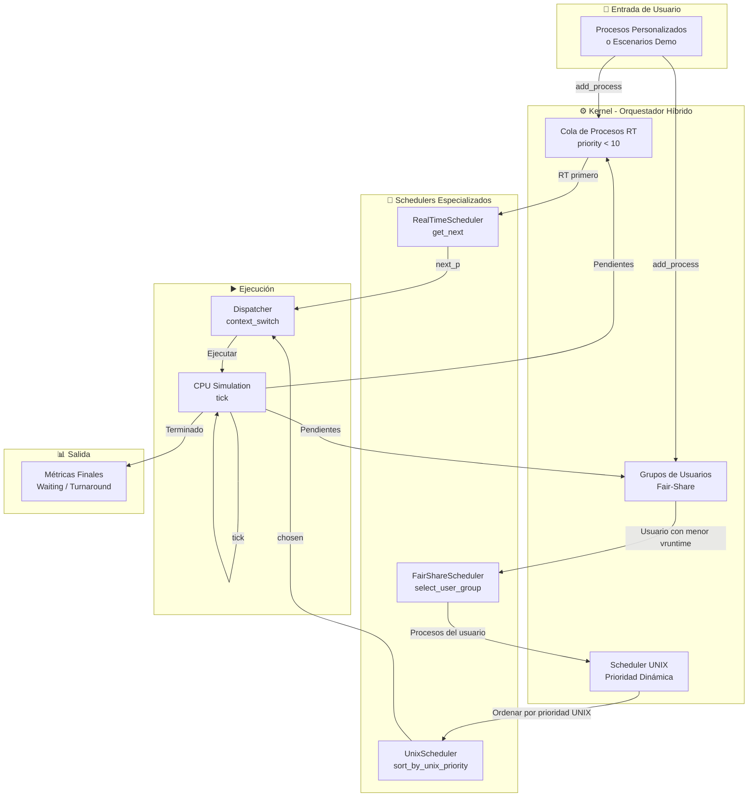
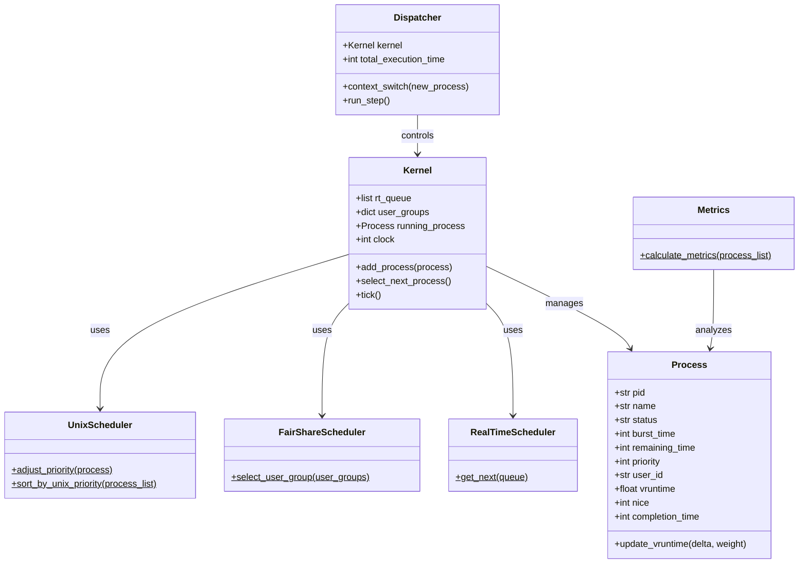

<h1 align="center">
  
</h1>

<div align="center">
  
  
  
  
</div>

<br>

<p align="center">
  
</p>

# PROYECTO
Este repositorio implementa un **Planificador de Procesos Híbrido de última generación**. No es solo un algoritmo aislado; es un Kernel jerárquico que integra cuatro lógicas de planificación que conviven en sistemas operativos modernos.

> [!IMPORTANT]
> **Proyecto Escolar:** Creado para simular la gestión de recursos de CPU. Incluye documentación detallada en formato `.docx` dentro del repositorio.


# 🧠 Arquitectura del Algoritmo
El sistema unifica los siguientes paradigmas en una estructura de datos modular de 4 capas:

| Capa | Algoritmo | Propósito |
| :--- | :--- | :--- |
| **Capa 0** | **Hard Real-Time (RT)** | Prioridad absoluta para procesos críticos (Sensores, Emergencias). |
| **Capa 1** | **Fair-Share** | Distribución equitativa por grupos de usuarios. |
| **Capa 2** | **UNIX Feedback** | Uso de valores *Nice* y penalizaciones dinámicas. |
| **Capa 3** | **Round Robin (RR)** | Gestión de ráfagas de tiempo (Quantums) para interactividad. |


# 🛠️ Tecnologías Utilizadas
<div align="left">
  
  
  
  
</div>


### Diagrama de Flujo de Datos



### Diagrama de Clases




# 🚀 Metodo de instalacion y uso

## Prerrequisitos
- Python 3.10 o superior
- pip (gestor de paquetes de Python)
- Git (opcional, para clonar el repositorio)

### 1. Clonar el repositorio
```
git clone https://github.com/eduseso-66/AlgortimoPlanificaci-nHibrido.git
cd AlgoritmoPlanificaci-nHibrido
```
### 2. Instalar las dependencias necesarias
```
pip install -r requirements.txt
```
### 3. Iniciar el simulador
```
python main.py
```
# Recomendacion
Es de crucial importancia mencionar que, para evitar problemas recomendamos crear un entorno virtual en Python para evitar fallas (si se presentan).
```
python -m venv env
```
Una vez creado el entorno virtual debe activarse usando los siguientes comandos.
En Windows:
```
env\Scripts\activate
```
En MacOS/Linux:
```
source env/bin/activate
```
Para desactivar el entorno virtual se usa el siguiente comando:
```
deactivate
```
## Integrantes y participantes de la creación de este proyecto
<h2 align = "center">
  
</h2>

## 👨‍💻 Autores

**eduseso-66**

- GitHub: [@eduseso-66](https://github.com/eduseso-66)
- Repositorio: [AlgortimoPlanificaci-nHibrido](https://github.com/eduseso-66/AlgortimoPlanificaci-nHibrido.git)


## 🙏 Agradecimientos

- Inspirado en los algoritmos de planificación de Linux (CFS) y UNIX
- Documentación de [SimPy](https://simpy.readthedocs.io/) para simulación de eventos
- Comunidad de Python por las herramientas y librerías


<p align="center">
  <b>⭐ ¡Si este proyecto te fue útil, dale una estrella! ⭐</b>
</p>


